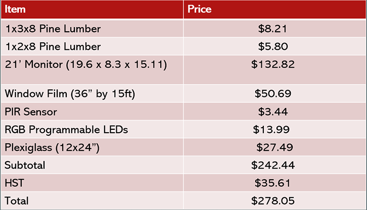
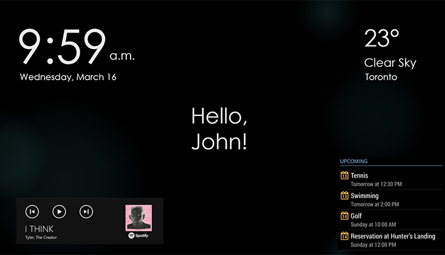

# Smart Mirror Capstone Project :desktop_computer:

This project uses an amazon echo to communicate with the Raspberry Pi to create a hands-free media experience for the user.  We used [MagicMirror](https://github.com/MichMich/MagicMirror) repository as a reference for our work, they have a community to help you get started with your own magic mirror project. Click [here](Reports/G36-490_Final_Report.pdf) to see the full final report.
## Bill of Materials :dollar:

## Hardware Design :computer:

## Alexa Voice Integration :microphone:

## User Interface :eyes:

## Starting the Mirror :running_man:
 > *This section is currently still being finished*

## Team :necktie:
**Adams Liu** : Alexa Voice Integration
**Ian Chang**: Hardware and Frame
**Kingsley Chu**: User Interface

 

